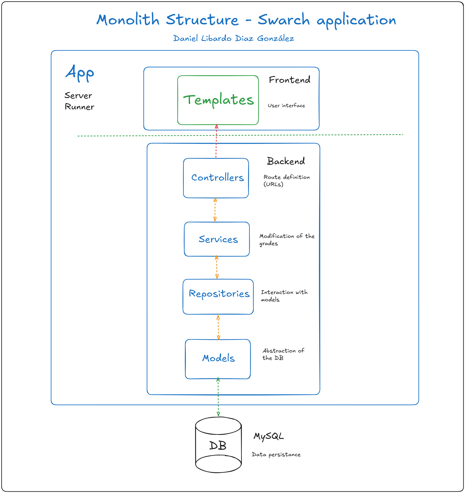

# Laboratory 1 - Architectural Design

Analysis of the architecture of the application **swarch**, a simple academic management application.

## Full name

Daniel Libardo Diaz González

## Graphical representation of the system structure

The system follows a monolith architecture, which means all the systems' components are stored and maintained in a single codebase.

The following graphical representation divides the monolith in three layers: frontend, backend, and data persistance (DB). It also gives an insight on the use of each component.

## Description of five (5) identified system properties

### 1. Maintainability (quality property)

The system can be maintained due to its clear structure, and layered access: templates as user interface, and the backend application that interacts with the database.

### 2. Modularity (quality property)

The monolith is divided into different modules with single responsibility, such as **controllers** managing the routes of the application, or **models** abstracting the database.

### 3. Usability (quality property)

The system has a simple user interface that allows users to interact with course grades, either by listing them, creating them, or deleting them.

### 4. Portability (quality property)

The system supports deployment across different execution environments without requiring code modification.

### 5. Creation, Reading and Deletion of grades (externally visible behavior)

The system allows for the creation, listing (reading), and deleting of grades. Note that it doesn't offer a full CRUD because there's no way for users to update grades.